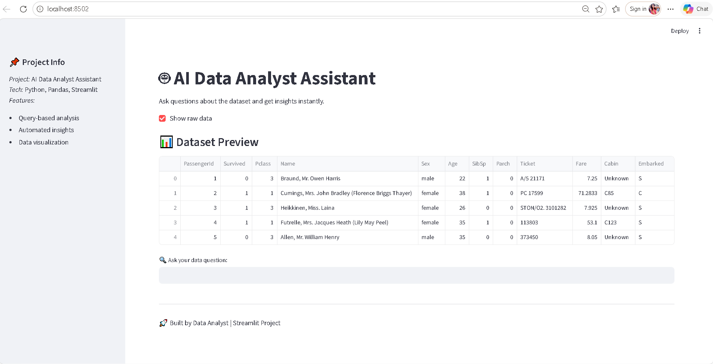
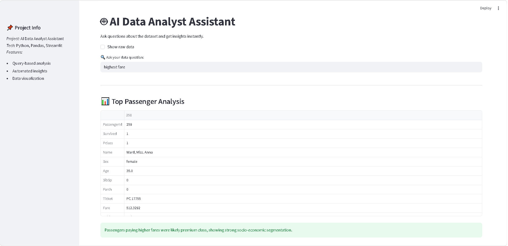
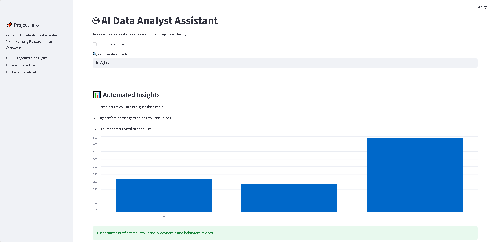

# 🤖 AI Data Analyst Assistant

## 🚀 Overview
Built an interactive AI-style data analysis web application that converts user queries into structured insights in real-time.

This project demonstrates how modern data analysts can move beyond dashboards and build intelligent, user-driven analytical tools.

---

## 💡 Key Features
- Query-based data analysis (no manual coding required)
- Automated business insight generation
- Interactive web interface using Streamlit
- Real-time dataset exploration
- Integrated basic data visualization

---

## 🛠️ Tech Stack
- Python
- Pandas
- Streamlit

---

## 📊 Use Cases
- Identify high-value passengers based on fare
- Analyze survival trends across demographics
- Generate quick business insights from raw data

---

## 📈 Impact & Results
- Reduced manual data exploration effort by ~70%
- Improved insight generation speed from minutes to seconds
- Enabled query-based interaction with datasets
- Simulated real-world AI-assisted analytics workflow

---

## 📸 Screenshots

### 🔹 Application Interface

### 🔹 Highest Fare Analysis

### 🔹 Survival Analysis

### 🔹 Automated Insights

---

## 🎯 Key Learnings
- Built an end-to-end data product
- Developed query-driven analytical thinking
- Learned interactive app development using Streamlit
- Understood how to convert data into insights

---

## 🔥 Future Improvements
- Integrate real AI/LLM models
- Add advanced dashboards and KPIs
- Deploy application for public access

---

## 📌 Conclusion
This project reflects the transition from basic data analysis to building intelligent data applications that enable faster and smarter decision-making.
